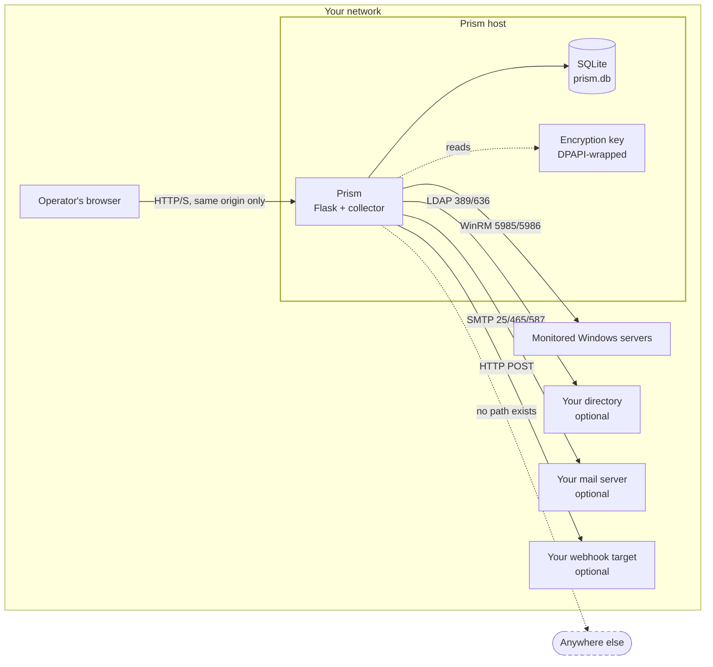

# Prism for a security reviewer

You have been asked to sign off on a monitoring tool that will hold WinRM
credentials for a Windows fleet. This is the document to read first. It is
written for a technical peer doing vendor due diligence, and its organising
assumption is that **you will verify rather than believe** — so every claim
below either points at the source, or at a command you can run.

`SECURITY.md` is the policy: supported versions, how to report a vulnerability,
the threat model. This is the evidence.

---

## The short answer

| question | answer | verify it |
|---|---|---|
| Does it phone home? | **No vendor endpoint exists.** No telemetry, licence check, update ping, analytics or crash reporting. | [`DATA_FLOWS.md`](DATA_FLOWS.md), `python tools/audit_outbound.py` |
| Where does it connect? | Only where your configuration points it. **24 outbound call sites, 0 with a hardcoded destination.** | `tests/test_outbound_ratchet.py` |
| Does it need internet? | **No.** Core monitoring is LAN-only. | [`LAN_ONLY_VERIFICATION.md`](LAN_ONLY_VERIFICATION.md) |
| Does the browser load third-party code? | **No.** Everything is vendored and served from Prism's origin; the CSP names no external origin. | `tests/test_csp.py` |
| Where does the data live? | One SQLite file on your host. | §"Storage" below |
| Are credentials protected? | Encrypted at rest; on Windows the key is DPAPI-wrapped to the service account. | `tests/test_credential_encryption_at_rest.py` |
| Can a host admin read it all? | **Yes — see §"The honest boundary".** | stated plainly, not buried |

---

## What Prism is, in one paragraph

A self-hosted web application that monitors an on-premises Windows server
fleet over WinRM. It polls each configured server for CPU, memory, disk,
services, Windows updates, event logs and failed logins; stores the results in
a local SQLite database; and presents them through a Flask web UI. It can
optionally authenticate operators against your Active Directory, email alerts
through your mail server, and post to a webhook you nominate. It runs as one
process on one host inside your network.

---

## Data flow



The dashed edge is the claim. Everything solid is a destination you configured;
there is no fourth kind of arrow. `DATA_FLOWS.md` enumerates every call site
that could add one.

---

## Storage — where your data actually is

Everything Prism knows lives in **one SQLite file on the Prism host**,
`data/prism.db`. There is no second copy, no cache service, no object store,
and nothing is written outside the installation directory.

| what | where | notes |
|---|---|---|
| Metrics, events, logs, audit trail | `data/prism.db` | one file |
| Server credentials | `data/prism.db`, Fernet-encrypted | never stored plain |
| Encryption key | `data/prism.key` (or `prism.key.dpapi`) | see below |
| Configuration | `config.json` | filesystem permissions restricted at startup |
| Backups | `data/backups/<timestamp>/` | local, see below |
| Audit mirror | `data/audit_mirror.jsonl` | append-only second copy of the audit trail |

### Credentials at rest

WinRM and LDAP bind passwords are encrypted with Fernet (AES-128-CBC +
HMAC-SHA256) before they reach the database — `crypto_utils.py`,
`encrypt_password()` / `decrypt_password()`. On Windows the Fernet key is
wrapped with **DPAPI bound to the account Prism runs as**, so lifting
`prism.db` and `prism.key.dpapi` onto another machine yields a key that
decrypts to garbage. `tests/test_credential_encryption_at_rest.py` asserts that
no plaintext password reaches the file.

### Retention — you decide how long

Per-table, in `config.json`, because one uniform number is why raw logs
dominate a monitoring database:

| data | default |
|---|---|
| raw log lines | 7 days |
| log signatures | 90 days |
| metrics | 30 days |
| events | 90 days |
| **audit log** | **365 days** |

The audit trail has its own knob deliberately: an audit log truncated by a
debug-logging setting is a finding, not a feature.

### Backups

Written locally under `data/backups/`. **A backup is only as protected as where
you put it** — if it contains `prism.key.dpapi`, that key is bound to the
original service account and will not decrypt elsewhere, which is a safety
property for a stolen backup and a restore hazard for a legitimate one. The
restore procedure is in `docs/BACKUP_AND_RESTORE.md`; read it *before* you need
it.

---

## The honest boundary

**Anyone with administrator rights on the Prism host can read everything Prism
holds.** They can read the database file, they can read the key beside it, and
on Windows they can run as the service account that DPAPI is bound to. No
application-level control changes that.

That is a property of running software on a computer, not a defect in Prism,
and any vendor telling you otherwise is describing something they have not
thought about. What Prism can honestly claim is narrower and more useful:

- **Application access is controlled and audited.** RBAC tiers, dual-control on
  tier-0 destructive operations, and an append-only audit log with a
  tamper-evident hash chain (`tests/test_audit_chain.py`).
- **Secrets are encrypted at rest**, so possession of the database file alone
  is not possession of your server passwords.
- **Sessions can be revoked**, so a departing operator's access ends when you
  say it does rather than when their cookie expires.

The control that matters most for the boundary is therefore not in Prism: it is
who has local administrator on the Prism host. Treat that host as tier-0,
because it holds credentials for tier-0.

---

## What we looked for and did not find

Absence is harder to evidence than presence, so this is the search, not the
conclusion. Each is reproducible.

- **No telemetry, licence check, update ping, analytics or crash reporter.**
  Grep in `DATA_FLOWS.md`; every hit is Prism's own vocabulary for counters it
  shows you.
- **No external host in the Python source.** Enforced, not just checked:
  `tests/test_outbound_ratchet.py` fails the build on a new one.
- **No third-party front-end asset.** Tailwind, htmx, idiomorph, Chart.js,
  Lucide and both fonts are vendored; the CSP permits no external origin and
  `tests/test_csp.py` reads the whole header to say so.
- **Nine direct dependencies**, all mainstream: `flask`, `flask-wtf`,
  `flask-limiter`, `pypsrp`, `waitress`, `cryptography`, `ldap3`, `reportlab`,
  and `pywin32` on Windows. Hash-pinned — see `docs/DEPENDENCIES.md`.

---

## Findings we fixed, and how we handled them

A document that only lists good news is not evidence. Both of these were found
by auditing for this review, and both are recorded rather than quietly
corrected — **how a project treats a finding is itself a control.**

**The CSP allowed three CDN origins that nothing used.** `script-src` permitted
`cdn.tailwindcss.com`, `unpkg.com` and `cdn.jsdelivr.net`, with `style-src` and
`connect-src` carrying some of the same. They were left behind when the front
end was vendored, and the comment justifying them still described a CDN runtime
that no longer existed. Nothing was broken and nothing was being fetched —
which is exactly why it survived, because **an allowlist entry nothing uses
still grants the capability.** Now `'self'` throughout, with a test that reads
the entire header.

**HTTPS health checks did not verify certificates.** The probe set
`CERT_NONE` unconditionally, so an HTTPS health check proved that something
answered on the port, never that it was the service you meant. Verification is
now on by default and can be turned off **per check**, in a row, by an operator
who knows that endpoint is self-signed — with the probe reporting which mode it
ran in, so the weaker setting leaves a trace instead of living in a constant.
Five mutations cover the four layers that carry the setting.

Still open, and stated so you can weigh it: nothing at present. Items we
deliberately have not changed are argued in `DATA_FLOWS.md`.

---

## How this stays true

A document goes stale the day it is written. These do not:

| check | what it fails the build on |
|---|---|
| `tests/test_outbound_ratchet.py` | a new outbound path, a hardcoded destination, an external host literal |
| `tests/test_csp.py` | any CSP directive naming an external origin |
| `tests/test_route_governance.py` | a mutating endpoint without auth or without an audit write |
| `tests/test_health_check_tls.py` | certificate verification being weakened at any of four layers |
| `tests/test_credential_encryption_at_rest.py` | a plaintext password reaching the database |
| `tests/test_audit_chain.py` | a break in the audit hash chain |

Every one of these is additionally **mutation-checked**: `python
tools/verify_guardrails.py` reintroduces each defect on purpose and fails if
the test does not notice. A passing test proves nothing on its own, and this
project's most-repeated failure — catalogued in `docs/OPS-LEARNINGS.md` — is a
check that reports success without doing the work.

---

## Reproducing all of it

```bash
python -m pytest tests/ -q          # the whole suite
python tools/audit_outbound.py      # every outbound call site + destination
python tools/verify_guardrails.py   # break each guard on purpose; all must be caught
python tools/verify_lan_only.py --port 5000 --seconds 180   # live destination census
```

The census exits 0 only if it actually observed traffic and none of it left your
network; it exits 3 for INCONCLUSIVE if it observed nothing, rather than
crediting itself with a pass.

Then run the firewall procedure in [`LAN_ONLY_VERIFICATION.md`](LAN_ONLY_VERIFICATION.md),
which is the evidence that does not depend on trusting any of the above.

If you find something these documents do not describe, that is a finding and we
want it — reporting instructions are in `SECURITY.md`.
